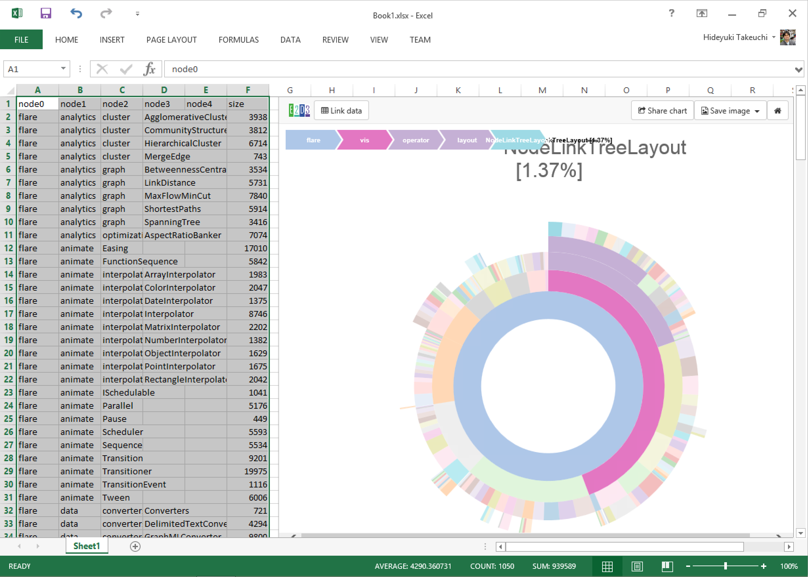

## アジェンダ

- E2D3って何？

- E2D3の可視化テンプレートを作ってみる

---

# E2D3って何？

### E2D3基盤制作部
### たけうち　ひでゆき

<div style='text-align: left'>
  
</div>

---

## OSSプロジェクト「E2D3」

E2D3: Excel to D3.js

- http://e2d3.org/
- https://github.com/e2d3/

データ可視化のテンプレートに<br>
Excelからデータを流し込むことのできるソフトウェア

1. エンジニアがデータ可視化テンプレートを<br>
   作って共有する
2. エンドユーザがそれにデータを流し込み<br>
   ブログやSNSで公開する

---

## E2D3の導入方法

1. Excel2013 もしくは ExcelOnline (無料) を立ち上げる
2. INSERTタブ -> Office Add-ins をクリック <!-- .element: class="fragment" -->
3. STOREリンクをクリックした後、<br>検索ボックスで「E2D3」を検索 <!-- .element: class="fragment" -->
4. E2D3を選択して、「Trust It」を押すと挿入される <!-- .element: class="fragment" -->

---

## デモ



---

# E2D3の
# 可視化テンプレートを
# 作ってみる

### E2D3基盤制作部
### たけうち　ひでゆき

<div style='text-align: left'>
  
</div>

---

# E2D3の
# 可視化テンプレートを
# 作ってみる

### E2D3基盤制作部
### たけうち　ひでゆき

<div style='text-align: left'>
  
</div>

---

## このプレゼンの趣旨

E2D3のデータ可視化テンプレートの開発を<br>
一通りできるように、e2d3コマンドの使い方と<br>
作るときの注意点についてハンズオン形式で<br>
説明します。

---

## その他の資料

GitHubの[e2d3/e2d3](https://github.com/e2d3/e2d3)内の[Wiki](https://github.com/e2d3/e2d3/wiki/Home_ja)に<br>
大体同じ内容の話が文章で書いてあります<br>
(英語/日本語)。

---

## テンプレート開発に必要なもの

- [Node.js](https://nodejs.org/) v0.12.x
  - [nodebrew](https://github.com/hokaccha/nodebrew) (for MacOSX) or [nodist](https://github.com/marcelklehr/nodist) (for Windows) を使ってインストール
- Git
- [Google Chrome](https://www.google.com/chrome)
- [Microsoft Excel Online](https://office.live.com/start/Excel.aspx?ui=ja-JP)
  - Microsoftアカウントを作れば無料で使えます

### + お好きなテキストエディタ

- 例えば、[Atom](https://atom.io/)

---

## 準備

### e2d3コマンドをnpm経由でインストール

```bash
$ npm install -g e2d3
```

### e2d3-contribレポジトリをクローン

```bash
$ git clone git@github.com:e2d3/e2d3-contrib.git
```

---

## テンプレート開発環境の起動

`e2d3-contrib`レポジトリをcloneしてきた<br>
ディレクトリ内で`e2d3`コマンドを実行

```bash
e2d3-contrib$ e2d3
[E2D3] Publish /Users/chimera/Sites/e2d3-server/e2d3/contrib
[E2D3] Webserver started at http://0.0.0.0:8000
[E2D3] Webserver(SSL) started at https://0.0.0.0:8443
```

実行するとブラウザが立ち上がり、<br>
`e2d3-contrib`内のチャート一覧が表示される。

表示されない場合は、<br>
http://localhost:8000/ にアクセス。

---

## 初めてのテンプレート作成

`e2d3`コマンドを実行した状態で、

1. `e2d3-contrib`ディレクトリ内で<br>
   `barchart-javascript`をコピー
  - この時点でブラウザ内のチャート一覧にコピーした名前で表示される
2. コピーしたチャート内のmain.jsファイルを変更して<br>保存する <!-- .element: class="fragment" -->
3. ブラウザが自動的に更新され変更されたチャートが<br>表示される <!-- .element: class="fragment" -->

---

## 初めてのテンプレートデバッグ

`e2d3`コマンドを実行した状態で、

1. https://localhost:8443/ にブラウザでアクセスし、<br>自己認証SSLを許可する。
2. Excel Onlineを立ち上げ、Officeストアから<br>E2D3を起動する <!-- .element: class="fragment" -->
3. E2D3の画面を一度クリックし、Ctrlキーを5回叩く <!-- .element: class="fragment" -->
4. 右上に「Go into delegate mode」と出るのでクリック <!-- .element: class="fragment" -->

この状態でローカルのウェブサーバの内容が参照されるようになり、
作ったテンプレートのExcelを使用したデバッグができます。 <!-- .element: class="fragment" -->

---

## E2D3テンプレートの構成要素

<dl>
  <dt>main.js</dt>
  <dd>データ可視化で初めに実行されるファイル</dd>
</dl>
<dl class="fragment">
  <dt>main.css</dt>
  <dd>main.jsの実行前に読み込まれるCSSファイル</dd>
</dl>
<dl class="fragment">
  <dt>thumbnail.png</dt>
  <dd>一覧画面に表示されるサムネイル画像(廃止予定)</dd>
</dl>
<dl class="fragment">
  <dt>README.md</dt>
  <dd>一覧画面で表示されるチャートの説明</dd>
</dl>

---

## main.jsの基本構造

```js
//# require=d3

初期化ブロック:
  ここの位置で初期化を行う

function update(data) {

  データ更新ブロック:
    Excelでデータが更新される毎にdataにセルのデータが入って呼び出される

}
```

---

## 暗黙の変数&関数

<dl>
  <dt>root</dt>
  <dd>
    チャートを描画するべき先のHTML要素<br>
    d3やjQueryで`body`要素をselectしたりせずこれを使う
  </dd>
</dl>
<dl>
  <dt>function reload()</dt>
  <dd>
    topojson使用時等、非同期にデータ以外のファイルを読んだ後、`update()`を再度呼び出したいときに呼び出す
  </dd>
</dl>

---

## 外部ライブラリのロード

ファイルをmain.jsと同じ所に起き、<br>
main.jsの一行目の
```js
//# require=d3
```
の所に、カンマ区切りで".js"を取り除いたファイル名を記述してください。
```js
//# require=d3,jquery,topojson
```
等になります。

ただし、ライブラリはAMD形式という記述で書かれている必要があります。
(対応していない場合はご相談を)

---

## `function reload()`の使い方

`japanmap-javascript`を参照

```
初期化処理

d3.json('japanmap.json', function (error, json) {
  topojsonを使ってjsonとして読み込んだ地図を描画

  reload(); // update()をデータと共に明示的に呼び出す
});

function update(data) {
  一番初めに呼び出された時には、上記japanmap.jsonの読み込みが
  終わっていない場合があるのに注意
```

---

## `function update(data)`のdata変数について

`data`は文字列の二次元配列です。<br>
`data[0][0]`で1行1列目のセルの内容が文字列で<br>
返ります。

これをD3.js等で扱いやすいように転置したり、<br>
リスト形式、マップ形式、ネスト形式に変換する<br>
メソッドが用意されています。

---

## `data.transpose()`

行列を転置します。

|A|B|
|-|-|
|C|D|

<div style="align: center">↓</div>

|A|C|
|-|-|
|B|D|

---

## `data.toList(options)`

行列をリスト形式にします。

A|B|C
-|-|-
1|2|3
4|5|6

<div style="align: center">↓</div>

```js
[
  { A: 1, B: 2, C: 3 },
  { A: 4, B: 5, C: 6 },
]
```

一般的な順序のあるチャートで使います。

---

## `data.toList()の返り値`

### `var list = data.toList()`


<dl>
  <dt>list.header</dt>
  <dd>ヘッダが文字の配列で返ります。<br>
      特に何も指定しなければ一行目です。
  </dd>
</dl>

---

## `data.toList(options)`

<dl>
  <dt>options.header</dt>
  <dd>指定すると、一列目を項目名として使用せず、
      <br>指定された配列を使用します
  </dd>
  <dt>options.typed</dt>
  <dd>trueを指定すると文字列を数値や日付に変換して<br>
      返します。<br>
      大体の場合、指定した方が良いです。</dd>
</dl>


---

## `data.toMap(options)`

行列をマップ形式にします。

 |A|B|C
-|-|-|-
a|1|2|3
b|4|5|6

<div style="align: center">↓</div>

```js
{
  a: { A: 1, B: 2, C: 3 },
  b: { A: 4, B: 5, C: 6 },
}
```

主に都道府県マッピングとかで使います。

---

## `data.toMap()の返り値`

### `var map = data.toList()`


<dl>
  <dt>map.header</dt>
  <dd>ヘッダが文字の配列で返ります。<br>
      特に何も指定しなければ一行目です。
  </dd>
  <dt>map.keys</dt>
  <dd>データのキーが配列で返ります。<br>
      特に何も指定しなければ一列目です。
  </dd>
</dl>

---

## `data.toMap(options)`

<dl>
  <dt>options.header</dt>
  <dd>指定すると、一列目を項目名として使用せず、
      <br>指定された配列を使用します
  </dd>
  <dt>options.typed</dt>
  <dd>trueを指定すると文字列を数値や日付に変換して<br>
      返します。<br>
      大体の場合、指定した方が良いです。</dd>
</dl>

---

## チャートを作る際に気をつけて<br>欲しいこと

- 最終的にはWindowsのExcel2013で確認して欲しい
- 幅や高さを固定で作らない
  - 可能な限り`root.{clientWidth, clientHeight}`を元に計算する
- `update()`でデータが更新された際アニメーションすると嬉しい

---

## 自作のテンプレートを<br>E2D3に追加する

GitHub上でPullRequestを送っていただき、<br>
それが承認されると公開されます。

細かいやり方については、GitHub上のWikiの<br>
「自作のテンプレートをE2D3に追加する」の項に<br>
追加されているのでご覧ください。


---

## 何か分からないことがあれば

たけうちまでお気軽にご相談ください。

@chimerast

<div style='text-align: left'>
  
</div>


---

## 今後の開発者向け拡張予定

- gist対応
  - `e2d3-contrib`のcloneを不要にする
  - (本当はこの説明会までに間に合わせたかった)

---

## 今後のエンドユーザ向け拡張予定

- E2D3の状態のファイル保存機能
- UI/UX全面改定
- 簡易的なチャートのカスタマイズ
- ブラウザ上での直接入力&公開
